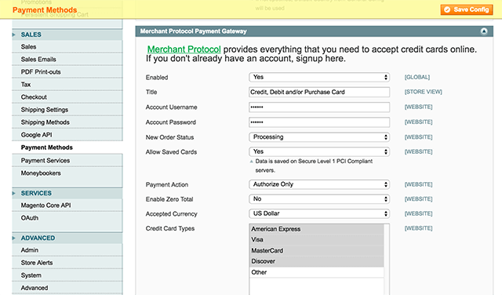
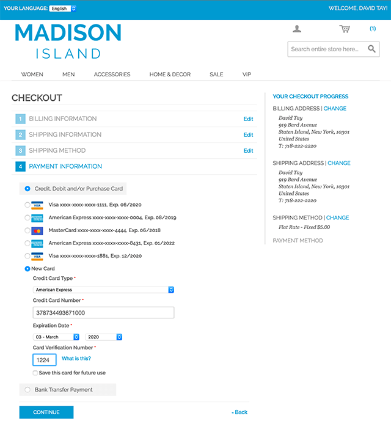
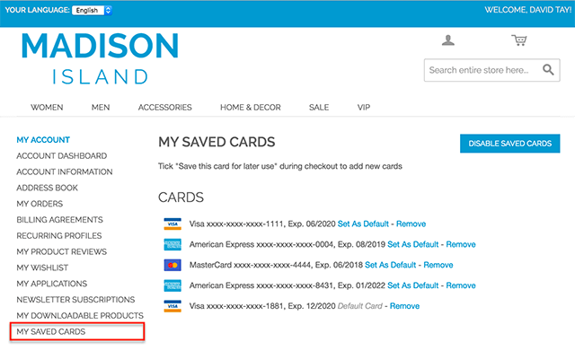
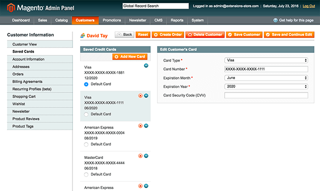

Enable payment method in the system configuration and enter your account credentials:

 

Payment method in the checkout. Customer will be able to save a new card and use a previously saved card:

 

Customer will be able to see his or her saved cards:

 

Administrators are able to add and edit customer credit cards:

 
